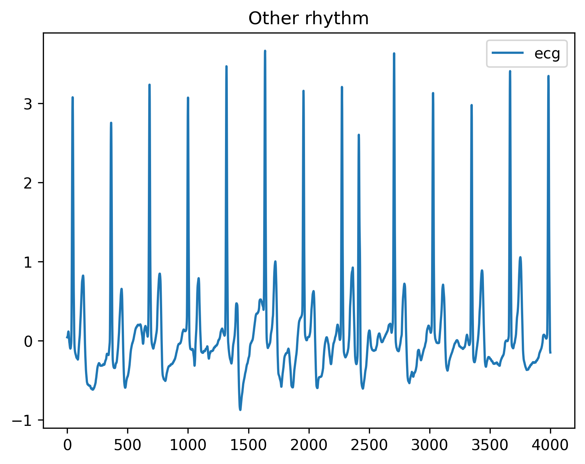

# ecg-arrhythmia-detection-dnn

This is an unofficial implementation of [Cardiologist-level arrhythmia detection and classification in ambulatory electrocardiograms using a deep neural network](https://www.nature.com/articles/s41591-018-0268-3?source=techstories.org).

Please star this repo if you find our work is helpful for you.

  
<b>Figure 1.</b> The ** of ECG signal.

  
<b>Figure 2.</b> The label unbalance stat.

  
<b>Figure 3.</b> The confusion matrix of ECG arrhythmia classification results.

