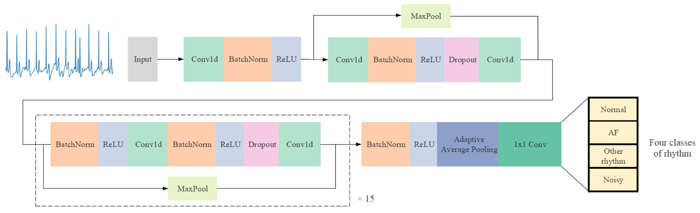
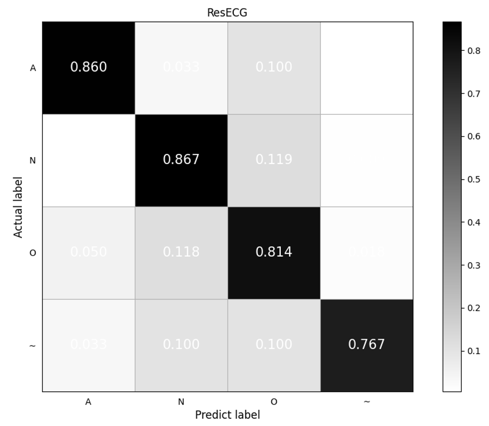
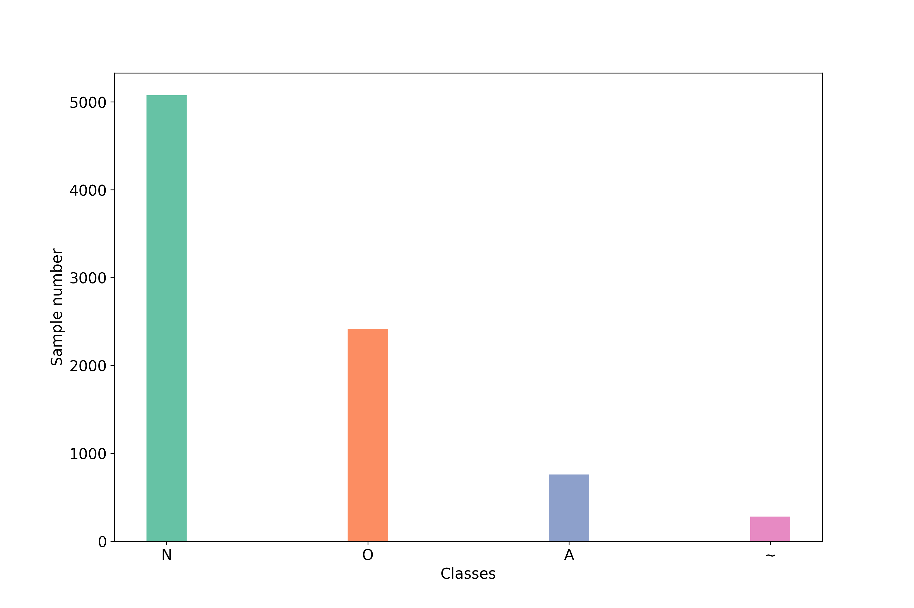

<style>
table {
margin: auto;
}
</style>
# ecg-arrhythmia-detection-dnn


This is an unofficial implementation of [Cardiologist-level arrhythmia detection and classification in ambulatory electrocardiograms using a deep neural network](https://www.nature.com/articles/s41591-018-0268-3?source=techstories.org).

Please star this repo if you find our work is helpful for you.

The **ResECG** net is a variant of the popular image classification network **ResNet**, which applies to ECG time-series classication. 

<p align="center">
<b>Figure 1.</b> The architecture of ResECG network.
</p>

## Environment
The code is developed using python 3.7 on Ubuntu 20.04. NVIDIA GPU is needed.

## Data preparing
The experiment was taken on the [Physionet 2017 challenge](https://www.physionet.org/challenge/2017/) dataset.
1. To download the datasets, run:
```
sh ./experiments/cinc17/setup.sh
```
or manually download from  [Physionet 2017 challenge dataset](https://www.physionet.org/content/challenge-2017/1.0.0/)

2. Then run the following code to obtain the json file for experiment config:
```
python ./experiments/cinc17/build_dataset.py
```

## Quick Start
### Installation
1. Clone this repo
2. Install dependencies:
   ```
   pip install -r requirements.txt
   ```
### Training
* Train ResECG net
  ```
  python tools/train.py --config "cfgs/ResECG.yaml"
  ```
### Evaluation
* validate ResECG net
  ```
  python tools/evaluate.py --config "cfgs/ResECG.yaml" --ckpt **path_to_checkpoint**
  ```

## Results Demonstration

|  Method                                 |   N   |   A   |   O   |   ~   | Total |
|------------------------------------|:-----:|:-----:|:-----:|:-----:|:-----:|
| Feature-based approach             | 0.899 | 0.768 | 0.737 | 0.66  | 0.766 |
| ResECG                             | 0.889 | 0.835 | 0.768 | 0.661 | 0.839 |
| ResECG（+ label unblanced weight） | 0.899 | 0.835 | 0.763 | 0.742 | 0.846 |
| ResECG（+ FocalLoss）              | 0.894 | 0.825 | 0.762 | 0.719 | 0.841 |

<p align="center">
<b>Table 1.</b> The F1 scores across different method.
</p>

The experimental results are demonstrated as Table.1. ResECG with label unbalanced weight attains the highest F1 score.

<!-- ### confusion matrix

<p align="center">

<br><br>
<b>Figure 2.</b> The confusion matrix of ECG arrhythmia classification results.
</p> -->

<!-- ### label unbalance
<p align="center">

<br><br>
<b>Figure 2.</b> The label unbalance stat.
</p> -->

## Contact
If you have any questions, feel free to contact me through jia.zeng@sjtu.edu.cn or Github issues.